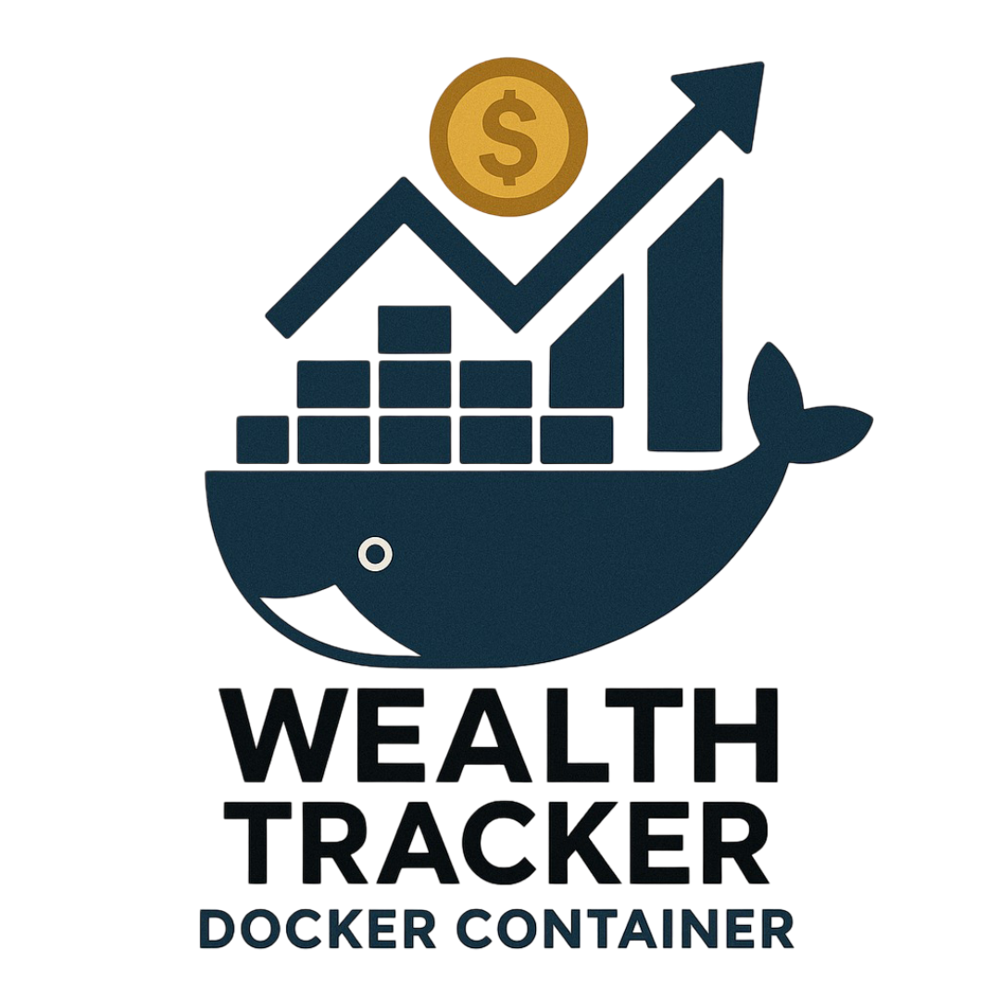
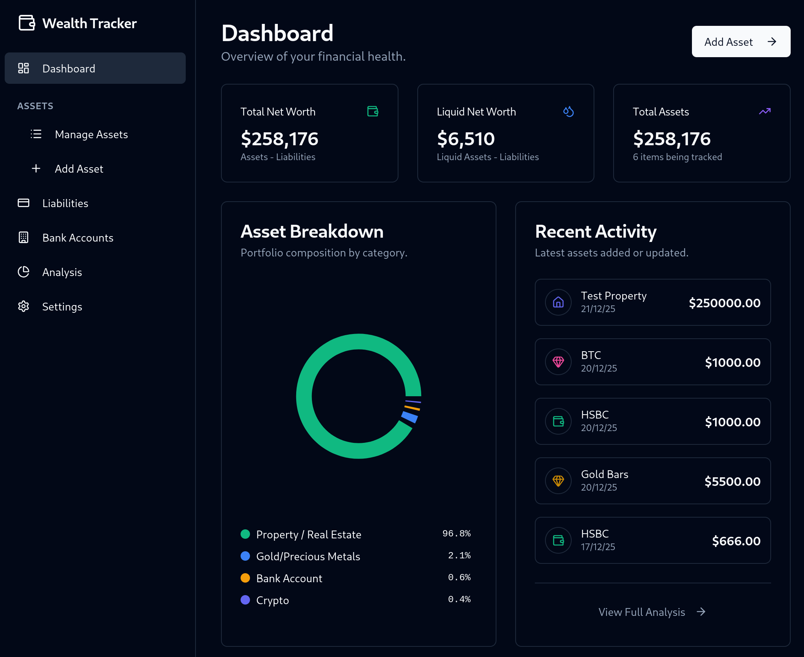
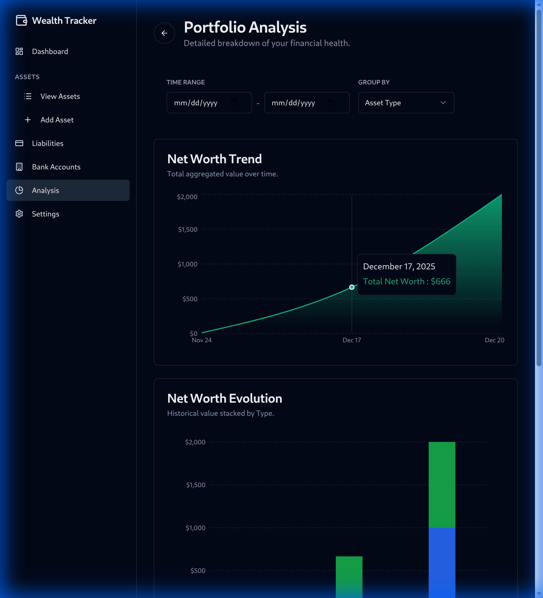
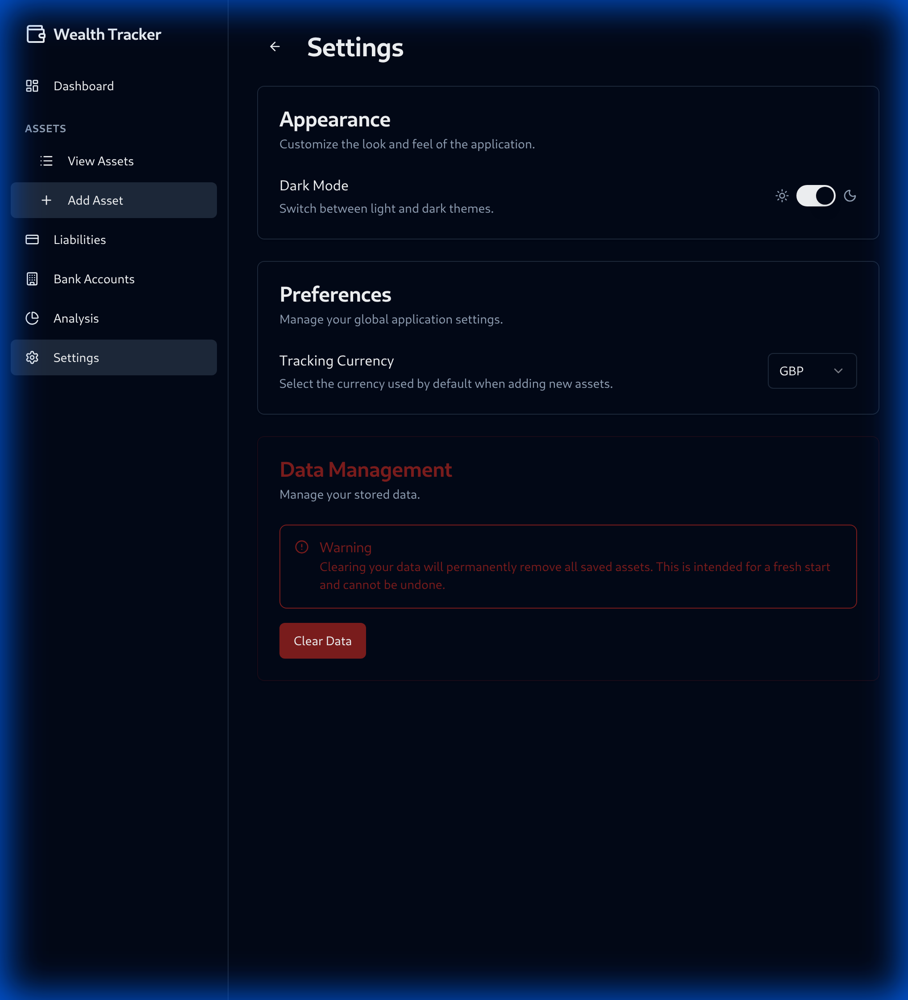

# Wealth Tracker

<p align="center">
  
</p>

Managing your personal finances shouldn't feel like a chore. **Wealth Tracker** is a modern, self-hosted dashboard designed to give you complete ownership of your financial data. Whether you're tracking crypto, real estate, or your savings jar, this app helps you visualize your net worth with style.

---

### 📸 A Look Inside

| **Your Financial Dashboard** |
|:---:|
|  |
| *Track all your assets in one place with custom icons and clear breakdowns.* |

<br/>

| **Deep Dive Analysis** | **Global Preferences** |
|:---:|:---:|
|  |  |
| *Visualize your net worth trend and asset allocation.* | *Manage tracking currency and theme (Dark/Light).* |

---

## why?

I built Wealth Tracker because I wanted a **simple, private, and fast** way to track my assets without relying on spreadsheet formulas or third-party cloud services that sell my data. 

**Key Features:**
*   **Complete Control:** It's self-hosted. Your data stays on your machine.
*   **Modern "Firetracker" UI:** Dark mode by default, crisp graphs (Recharts), and a professional aesthetic using **shadcn/ui** and **Tailwind CSS**.
*   **Flexible Assets:** Track everything from *Bank Accounts* and *ISAs* to *Gold Bars* and *Crypto*.
*   **Multi-Currency:** Set your global **Tracking Currency** (USD, GBP, EUR, etc.) and see your total wealth aggregated automatically.
*   **Visual Analytics:** 
    *   **Net Worth Trend:** An Area Chart showing your wealth accumulation over time.
    *   **Net Worth Evolution:** A Stacked Bar Chart grouping your history by asset type or currency.
    *   **Asset Allocation:** A Donut Chart showing exactly where your money is.

## 🛠 Tech Stack

We've recently overhauled the frontend for maximum performance and developer experience:

-   **Frontend:** [Vite](https://vitejs.dev/) + [React](https://reactjs.org/)
-   **Styling:** [Tailwind CSS](https://tailwindcss.com/) + [shadcn/ui](https://ui.shadcn.com/)
-   **Charts:** [Recharts](https://recharts.org/)
-   **Icons:** [Lucide React](https://lucide.dev/)
-   **Backend:** NestJS + TypeORM + PostgreSQL (Solid, reliable, type-safe).

## 🚀 Getting Started

1.  **Clone the repo:**
    ```bash
    git clone https://github.com/yourusername/wealth-tracker.git
    cd wealth-tracker
    ```

2.  **Spin it up with Docker:**
    The easiest way to run the full stack (Frontend + Backend + Database):
    ```bash
    docker-compose up --build
    ```

3.  **Manual Dev Mode:**
    *   **Backend:** `cd backend && npm run start:dev`
    *   **Frontend:** `cd frontend && npm run dev`

---

*Enjoy tracking your journey to financial freedom!* 🚀
