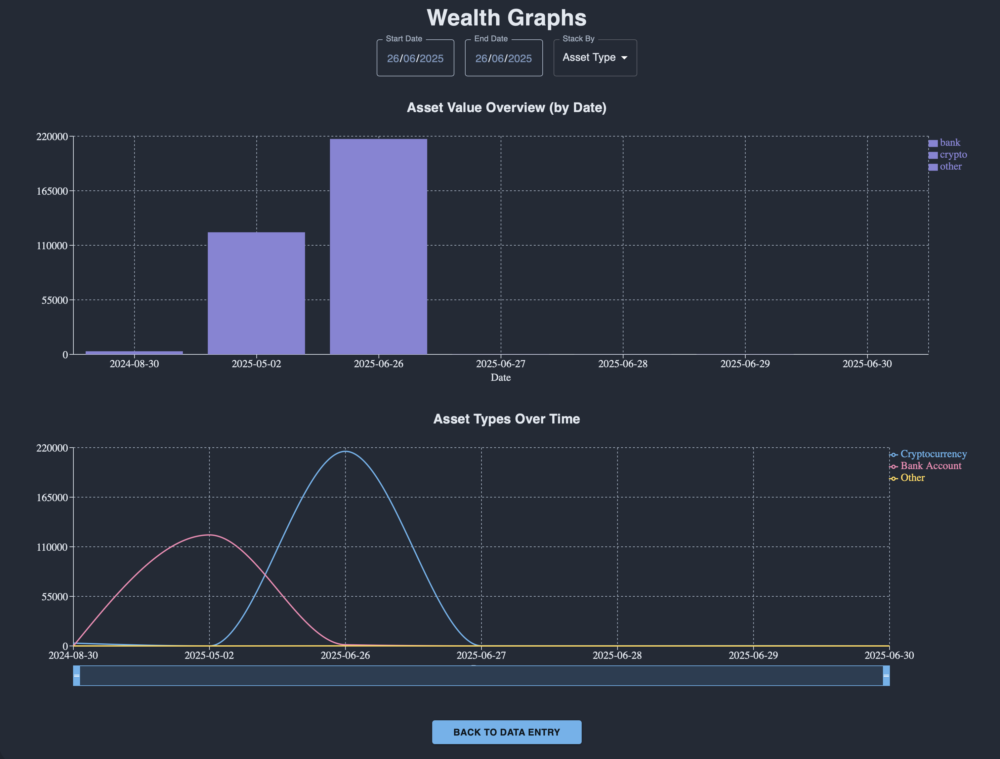

# Wealth Tracker

  

Wealth Tracker is a full-stack web application designed to help users track, visualize, and manage their assets and bank accounts over time. It provides a modern dashboard for entering, editing, and analyzing your financial data, supporting multiple asset types and currencies.

## Purpose

The purpose of Wealth Tracker is to give users a simple, private, and flexible tool to monitor their net worth, asset allocation, and financial growth. Unlike third-party services, this app is self-hosted, so your financial data stays under your control.

## Main Features

- **Asset Management:** Add, edit, and delete assets such as cryptocurrencies, bank accounts, and other investments.
- **Bank Account Management:** Add and remove bank accounts, and associate assets with them.
- **Data Visualization:** Interactive charts and graphs to visualize asset growth and allocation.
- **Multi-currency Support:** Track assets in various currencies (USD, EUR, GBP, PLN, BTC, ETH, etc.).
- **Filtering and Pagination:** Filter assets by type and date, and paginate large asset lists.
- **Modern UI:** Built with React and Material-UI for a responsive, dark-themed interface.
- **Secure Backend:** Built with NestJS and TypeORM, supporting HTTPS and JWT authentication.
- **REST API:** Backend exposes endpoints for managing assets and bank accounts.

## Tech Stack

- **Frontend:** React, Material-UI, Recharts
- **Backend:** NestJS, TypeORM, PostgreSQL
- **Deployment:** Docker support for both frontend and backend

## Getting Started

1. **Clone the repository**
2. **Configure environment variables** for both backend and frontend.
3. **Run with Docker Compose** or start backend and frontend separately.

---
